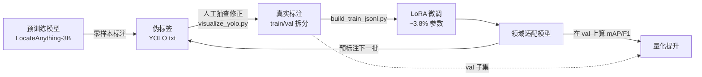

# scripts/annotation — YOLO 标注工具集（零样本标注 / 可视化 / 训练数据构建）

用预训练 LocateAnything-3B 对无标注小数据集做零样本检测（输出 YOLO 标注 txt），可视化校验标注，并构建 LoRA 训练数据；同时记录了“真实标注反饲 LoRA”的设计逻辑。

## 用法（WSL `locate_anything_sft` 环境）

```bash
python /mnt/c/Dev/locate_anything/scripts/annotation/annotate_yolo.py     --data /mnt/c/Data/datasets/detect     --classes "gas cylinder,electric scooter,bicycle"     --video-frames 8
```

## 输出

| 产物 | 位置 | 说明 |
|---|---|---|
| `<图片>.txt` | 图片同目录 | YOLO 格式 `class_id cx cy w h`（归一化 0~1） |
| `classes.txt` | 数据集根目录 | 类别名（每行一个，YOLO 惯例） |
| `<数据集>/_frames/<视频>/frame_*.jpg(.txt)` | 数据集内 | 视频抽帧 + 对应标注 |
| `outputs/annotation_detect/summary.json` | 仓库 outputs | 逐图统计 + 类别分布 + 错误 |
| `outputs/annotation_detect/manifest.jsonl` | 仓库 outputs | 图片路径 + boxes（供训练 JSONL 复用） |
| `outputs/annotation_detect/previews/*.jpg` | 仓库 outputs | 标注叠加预览图（人工抽查） |

## 关键参数

| 参数 | 默认 | 说明 |
|---|---|---|
| `--classes` | 必填 | 逗号分隔类别；索引即 YOLO class id |
| `--video-frames` | 8 | 每个视频最多抽帧数（均匀采样） |
| `--video-step` | 0 | 每隔 N 帧抽 1 帧（0=均匀撒点） |
| `--mode` | hybrid | 解码模式（hybrid/fast/slow） |
| `--temperature` | 0.0 | 标注建议 0（确定性） |
| `--overwrite` | - | 重新标注（默认已有 txt 跳过） |
| `--model` | ~/models/LocateAnything-3B | 基座模型路径 |

## 已知限制（2026-08-05 实测）

- 煤气罐（gas cylinder）：零样本识别稳定；
- 电动车/自行车：模型能稳定检出「两轮车」整体，但 `electric scooter` vs `bicycle` 子类判定有噪声（同一帧二选一，互斥）；用于伪标签训练时建议合并为单一「两轮车」类别或人工抽查修正。
- 坐标按模型约定输出为 [0,1000] 归一化后除以 1000 得到 YOLO 归一化坐标。


---

## visualize_yolo.py — YOLO 标注可视化

扫描数据集（递归），解析图片旁的 YOLO txt（`class_id cx cy w h`，归一化 0~1），把框画到图上生成预览与拼图，并输出统计/校验 summary。用于**人工抽查标注质量**（伪标注修正环节的必需品），也兼容任意 YOLO 格式数据集。

### 用法

```bash
# 在任意有 PIL 的 Python 环境即可（WSL env / 本机 bundled python 均可）
python /mnt/c/Dev/locate_anything/scripts/annotation/visualize_yolo.py \
    --data /mnt/c/Data/datasets/detect \
    --montage
```

### 输出

| 产物 | 位置 | 说明 |
|---|---|---|
| `previews/<图片名>.jpg` | `<out>/previews/`（默认 `<data>/_yolo_viz/`） | 每张图叠加标注框 + 类别名 |
| `montage.jpg` | `<out>/` | 缩略图拼图（`--montage`），快速总览 |
| `summary.json` | `<out>/` | 逐图框数/类别、类别分布、异常行/越界框/缺标注清单 |

### 关键参数

| 参数 | 默认 | 说明 |
|---|---|---|
| `--data` | 必填 | 数据集根目录（递归） |
| `--classes` | `<data>/classes.txt` | 逗号分隔类别名 |
| `--out` | `<data>/_yolo_viz` | 输出目录（在 data 内会被自动跳过，不重复扫描） |
| `--max-side` | 0 | 预览图最长边上限（0=原尺寸） |
| `--min-area` | 0.0 | 忽略归一化面积小于该值的框 |
| `--montage` / `--cols` / `--thumb` | - / 4 / 360 | 拼图开关与布局 |
| `--only-annotated` | - | 跳过无 txt 的图 |
| `--overwrite` | - | 覆盖已存在预览 |

### 健壮性（已测）

- 缺 txt → 记为 `missing_label`；空 txt → `empty`；不会崩溃；
- 行字段数 ≠ 5 / 非数字 → 记为 issue 并跳过该行；
- 坐标越界（如 `cx>1`）→ 记录 issue，绘制时双侧 clamp 并跳过完全在图像外的退化框（修复了 `x1>x2` 崩溃）；
- class_id 超出类别数 → 计入 `unknown_class_boxes` 并告警，不崩溃；
- 以 `_` 开头的目录（辅助目录约定）一律跳过，不会把自身输出当数据再扫一遍。

---

## 为什么 YOLO 真实标注要反哺 LoRA 训练

**结论：真实标注的价值不在"多"，而在"真"——它是唯一能打断模型自我强化错误循环、把"认识但不准"变成"认识且准"的质量锚点。**

### 1. 模型在目标域有系统性盲区（本环境已实测）

预训练模型学的是通用世界知识，对长尾/不常见物体有盲区。本项目实测（2026-08-05）：

- 煤气罐（gas cylinder）：零样本识别稳定；
- 电动车 vs 自行车：模型能稳定检出「两轮车」整体，但子类判定不稳（同一帧二选一、互斥，探针 1/4 帧把电动车标成 bicycle）；
- 部分 `bg_` 命名的图其实也有目标（命名 ≠ 空场景）。

这些是**有倾向的系统性错误**。伪标签自训练最大的风险是"回声室"：模型用自己的错标签强化自己的错误——必须用独立于模型的真实标注打断这个循环。

### 2. 四个具体意义

| 意义 | 说明 |
|---|---|
| **纠偏信号** | LoRA 训练 = 让模型看标准答案并更新那 ~3.8% 低秩参数。伪标签是模型自己的答案（错的也对不上），真实标注是 ground truth（错的也能对上），才能逐条修正 scooter/bicycle 混淆、漏检、误检 |
| **领域分布适配** | 小数据 LoRA 是"校准"通用能力到目标分布（监控视角煤气罐、街景电动车、竖屏视频帧），真实标注决定校准的准确性 |
| **评测闭环** | 真实标注拆 train/val，用 mAP/F1 量化 LoRA 前后提升——**微调前先留一批真实标注当评测集，是最重要的工程纪律** |
| **成本杠杆（数据飞轮）** | 第 1 轮从零标注（贵）→ LoRA；第 2 轮模型预标注 + 人工只改差异（便宜得多）；越往后修正量越少、数据越多、模型越准。YOLO txt 一行一框、人可读可改，是这条飞轮上最低成本的载体 |



### 3. 三个误区

| 误区 | 正确认知 |
|---|---|
| 真实标注越多越好 | ❌ 质量优先：少量高质量真实标注 > 大量噪声伪标签（伪标签混入会污染梯度） |
| LoRA 能无中生有学会新类别 | ❌ 小数据 LoRA 是校准/适配，不是新知识注入；YOLO class id ↔ 训练类别名必须对齐 |
| 伪标签自训练会自我提升 | ⚠️ 可能陷入回声室；有真实标注打断才成立 |

### 4. 置信度

- **事实（本环境已验证）**：预训练模型煤气罐稳、两轮车子类不稳；LoRA 单卡 16GB 可跑（~13s/it@2048）；伪标注已产出 93 框
- **推断（需实测）**：真实标注能显著修正子类混淆——提升幅度取决于标注质量与数量，必须用评测量化
- **预测（趋势性）**：迭代 2~3 轮后目标域精度收敛到收益递减平台；过早停止比过度训练更划算
